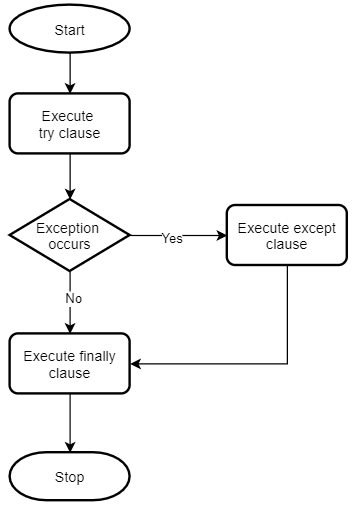

# Exception Handling

The try statement works as follows:  

- First, the try clause (the statement(s) between the try and except keywords) is executed  
- If no exception occurs, the except clause is skipped and execution of the try statement is finished  
- If an exception occurs during execution of the try clause, the rest of the clause is skipped. Then if its type matches the exception named after the except keyword, the except clause is executed, and then execution continues after the try statement  
- If an exception occurs which does not match the exception named in the except clause, it is passed on to outer try statements; if no handler is found, it is an unhandled exception and execution stops with a message as shown above  

A try statement may have more than one except clause, to specify handlers for different exceptions. 


  

```
try:
    # code that may cause exceptions
    
except:
    # code that handle exceptions
    
finally:
    # code that clean up
    # this block optional
    
```


## Catching Error

Different exception object has different attributes.

```{python}
try:
  a = 1 + 'a'
  
## catch specific  error  
except TypeError as err:
  print('I know this error !!!!',
        '\n Error: ', err,
        '\n Args:  ', err.args,
        '\n Type:  ', type(err))

## Catch all other error
except Exception as err:
  print( 'Error: ', err,
         '\nArgs:  ', err.args,
         '\nType:  ', type(err))
```

## Custom Exception

```{python}
try:
  raise Exception('bloody', 'hell')  #simulate exception

except Exception as err:
  print( 'Error: ', err,
         '\nArgs:  ', err.args,
         '\nType:  ', type(err))
```
