# matplotlib

## Library


```python
import matplotlib
import matplotlib.pyplot as plt
import seaborn as sns
import pandas as pd
import numpy as np

from plydata import define, query, select, group_by, summarize, arrange, head, rename
import plotnine
from plotnine import *

import os
os.environ['QT_QPA_PLATFORM_PLUGIN_PATH'] = "C:\ProgramData\Anaconda3\Library\plugins\platforms"
```


## Sample Data

This chapter uses the sample data generate with below code. The idea is to simulate two categorical-alike feature, and two numeric value feature:

- com is random character between ?C1?, ?C2? and ?C3?    
- dept is random character between ?D1?, ?D2?, ?D3?, ?D4? and ?D5?  
- grp is random character with randomly generated ?G1?, ?G2?  
- value1 represents numeric value, normally distributed at mean 50  
- value2 is numeric value, normally distributed at mean 25  


```python
n = 200
comp = ['C' + i for i in np.random.randint( 1,4, size  = n).astype(str)] # 3x Company
dept = ['D' + i for i in np.random.randint( 1,6, size  = n).astype(str)] # 5x Department
grp =  ['G' + i for i in np.random.randint( 1,3, size  = n).astype(str)] # 2x Groups
value1 = np.random.normal( loc=50 , scale=5 , size = n)
value2 = np.random.normal( loc=20 , scale=3 , size = n)
value3 = np.random.normal( loc=5 , scale=30 , size = n)

mydf = pd.DataFrame({
    'comp':comp, 
    'dept':dept, 
    'grp': grp,
    'value1':value1, 
    'value2':value2,
    'value3':value3 })
mydf.head()
```

```
##   comp dept grp     value1     value2     value3
## 0   C1   D4  G1  55.827663  22.379606  13.861915
## 1   C3   D3  G2  45.037737  20.918570  25.256043
## 2   C3   D5  G1  46.738772  20.372231  43.146254
## 3   C2   D5  G2  59.819199  20.083332   5.137196
## 4   C3   D2  G2  44.337830  17.374906  -1.295925
```


```python
mydf.info()
```

```
## <class 'pandas.core.frame.DataFrame'>
## RangeIndex: 200 entries, 0 to 199
## Data columns (total 6 columns):
##  #   Column  Non-Null Count  Dtype  
## ---  ------  --------------  -----  
##  0   comp    200 non-null    object 
##  1   dept    200 non-null    object 
##  2   grp     200 non-null    object 
##  3   value1  200 non-null    float64
##  4   value2  200 non-null    float64
##  5   value3  200 non-null    float64
## dtypes: float64(3), object(3)
## memory usage: 9.5+ KB
```

## MATLAB-like API

- The good thing about the pylab MATLAB-style API is that it is easy to get started with if you are familiar with MATLAB, and it has a minumum of coding overhead for simple plots.  
- However, I'd encourrage not using the MATLAB compatible API for anything but the simplest figures.  
- Instead, I recommend learning and using matplotlib's object-oriented plotting API. It is remarkably powerful. For advanced figures with subplots, insets and other components it is very nice to work with.

### Sample Data


```python
# Sample Data
x = np.linspace(0,5,10)
y = x ** 2
```

### Single Plot


```python
plt.figure()
plt.xlabel('x')
plt.ylabel('y')
plt.plot(x,y,'red')
plt.title('My Good Data')
plt.show()
```

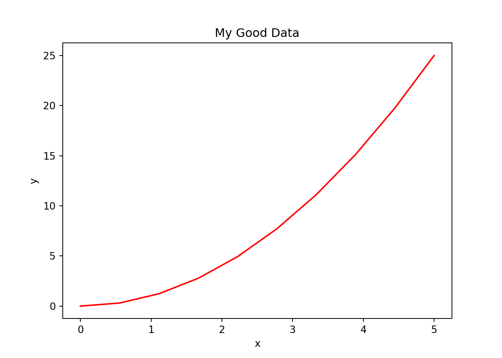

### Multiple Subplots
Each call lto **subplot()** will create a new container for subsequent plot command 


```python
plt.figure()
plt.subplot(1,2,1) # 1 row, 2 cols, at first box
plt.plot(x,y,'r--')
plt.subplot(1,2,2) # 1 row, 2 cols, at second box
plt.plot(y,x,'g*-')
plt.show()
```

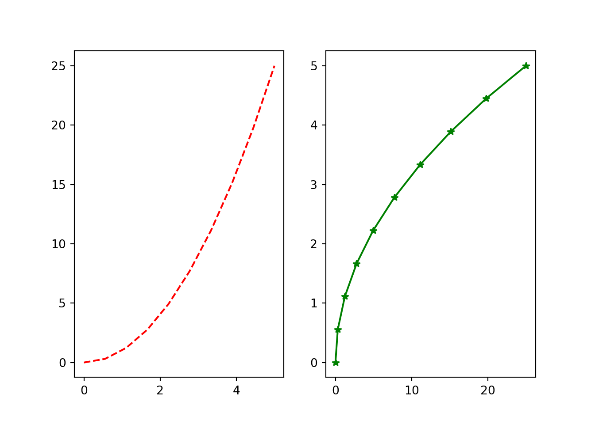

## Object-Oriented API

### Sample Data


```python
# Sample Data
x = np.linspace(0,5,10)
y = x ** 2
```

### Single Plot
**One figure, one axes**


```python
fig = plt.figure()
axes = fig.add_axes([0,0,1,1]) # left, bottom, width, height (range 0 to 1)
axes.plot(x, y, 'r')
axes.set_xlabel('x')
axes.set_ylabel('y')
axes.set_title('title')
plt.show()
```

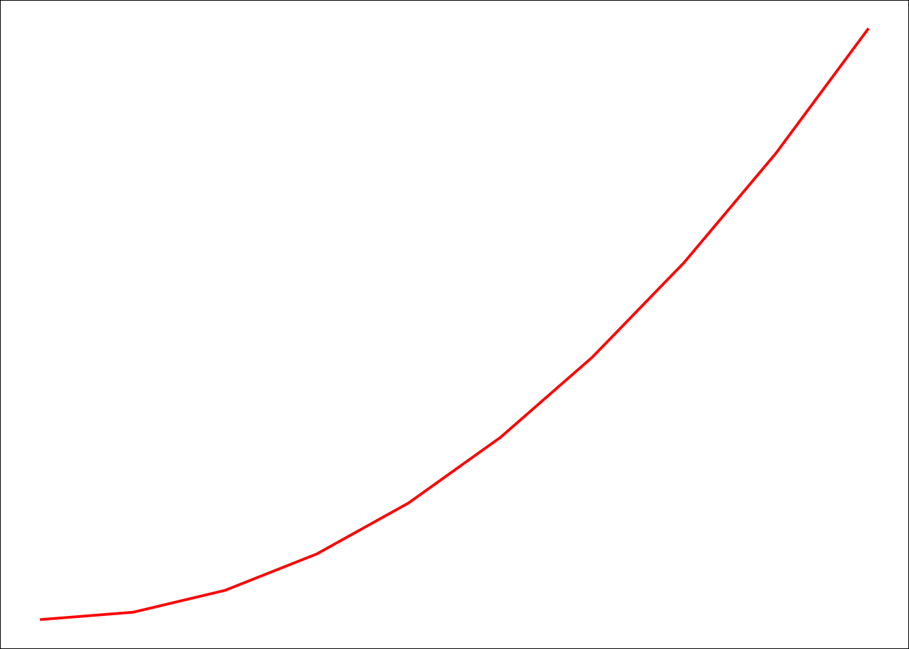

### Multiple Axes In One Plot
- This is still considered a **single plot**, but with **multiple axes**


```python
fig = plt.figure()
ax1 = fig.add_axes([0, 0, 1, 1])         # main axes
ax2 = fig.add_axes([0.2, 0.5, 0.4, 0.3]) # inset axes

ax1.plot(x,y,'r')
ax1.set_xlabel('x')
ax1.set_ylabel('y')

ax2.plot(y, x, 'g')
ax2.set_xlabel('y')
ax2.set_ylabel('x')
ax2.set_title('insert title')
plt.show()
```

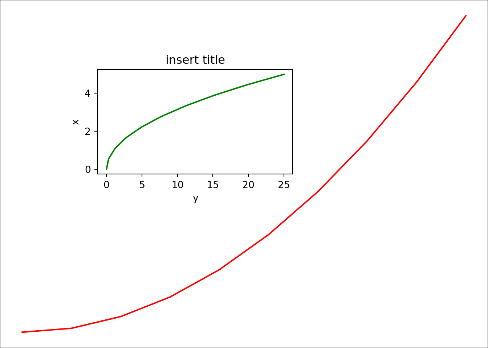

### Multiple Subplots
- One **figure**  can contain multiple **subplots**  
- Each subplot has **one axes**


#### Simple Subplots - all same size 
- subplots() function return axes object that is iterable.  

**Single Row Grid**  
Single row grid means axes is an 1-D array. Hence can use **for** to iterate through axes


```python
fig, axes = plt.subplots( nrows=1,ncols=3 )
print (axes.shape)
```

```
## (3,)
```

```python
for ax in axes:
    ax.plot(x, y, 'r')
    ax.set_xlabel('x')
    ax.set_ylabel('y')
    ax.set_title('title')
    ax.text(0.2,0.5,'One')
plt.show()
```

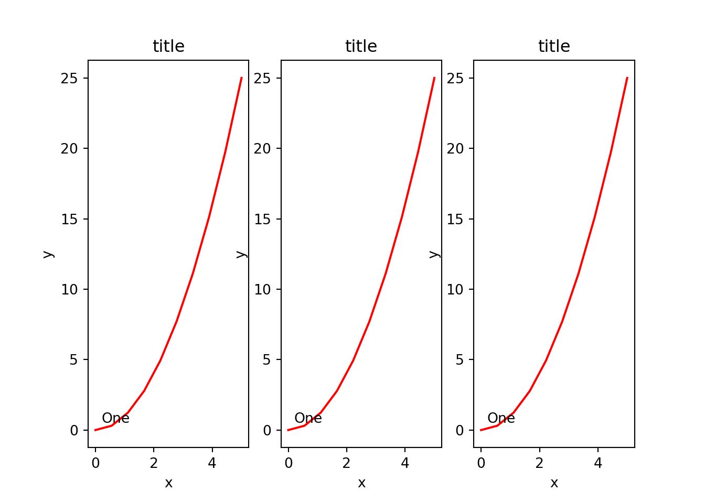

**Multiple Row Grid**  
Multile row grid means axes is an 2-D array. Hence can use two levels of **for** loop to iterate through each row and column


```python
fig, axes = plt.subplots(2, 3, sharex='col', sharey='row')
print (axes.shape)
```

```
## (2, 3)
```

```python
for i in range(axes.shape[0]):
    for j in range(axes.shape[1]):
        axes[i, j].text(0.5, 0.5, str((i, j)),
                      fontsize=18, ha='center')
plt.show()
```


#### Complicated Subplots - different size
- **GridSpec** specify grid size of the figure  
- Manually specify each subplot and their relevant grid position and size


```python
plt.figure(figsize=(5,5))
grid = plt.GridSpec(2, 3, hspace=0.4, wspace=0.4)
plt.subplot(grid[0, 0])  #row 0, col 0
plt.subplot(grid[0, 1:]) #row 0, col 1 to :
plt.subplot(grid[1, :2]) #row 1, col 0:2 
plt.subplot(grid[1, 2]); #row 1, col 2
plt.show()
```

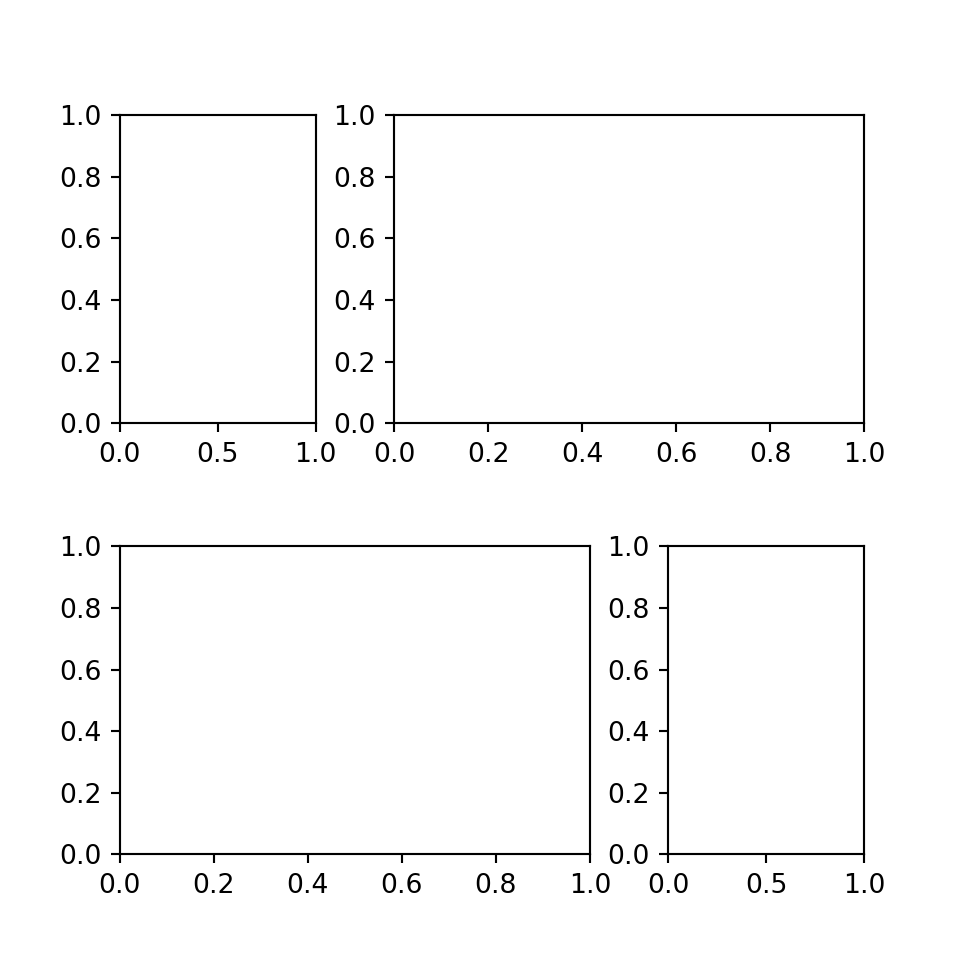


```python
plt.figure(figsize=(5,5))
grid = plt.GridSpec(4, 4, hspace=0.8, wspace=0.4)
plt.subplot(grid[:3, 0])    # row 0:3, col 0
plt.subplot(grid[:3, 1: ])  # row 0:3, col 1:
plt.subplot(grid[3, 1: ]);  # row 3,   col 1:
plt.show()
```

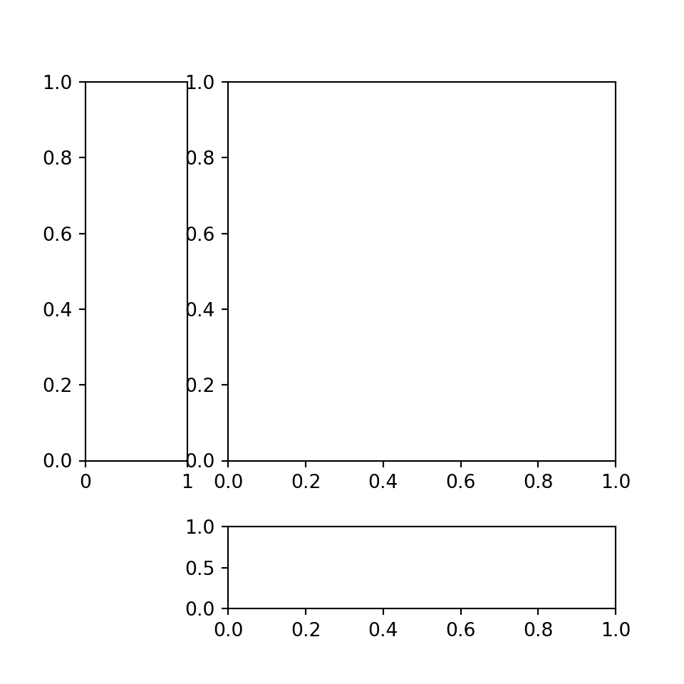

**-1 means last row or column**


```python
plt.figure(figsize=(6,6))
grid = plt.GridSpec(4, 4, hspace=0.4, wspace=1.2)
plt.subplot(grid[:-1, 0 ])  # row 0 till last row (not including last row), col 0
plt.subplot(grid[:-1, 1:])  # row 0 till last row (not including last row), col 1 till end
plt.subplot(grid[-1, 1: ]); # row last row, col 1 till end
plt.show()
```

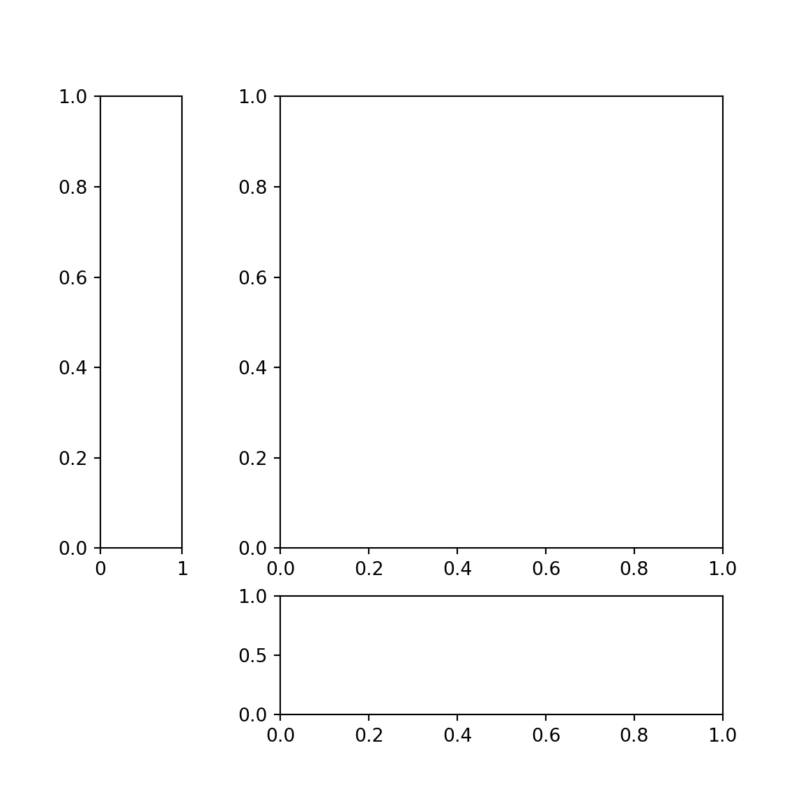

### Figure Customization

#### Avoid Overlap - Use tight_layout()
Sometimes when the figure size is too small, plots will overlap each other. 
- **tight_layout()** will introduce extra white space in between the subplots to avoid overlap.  
- The figure became wider.


```python
fig, axes = plt.subplots( nrows=1,ncols=2)
for ax in axes:
    ax.plot(x, y, 'r')
    ax.set_xlabel('x')
    ax.set_ylabel('y')
    ax.set_title('title')
fig.tight_layout() # adjust the positions of axes so that there is no overlap
plt.show()
```

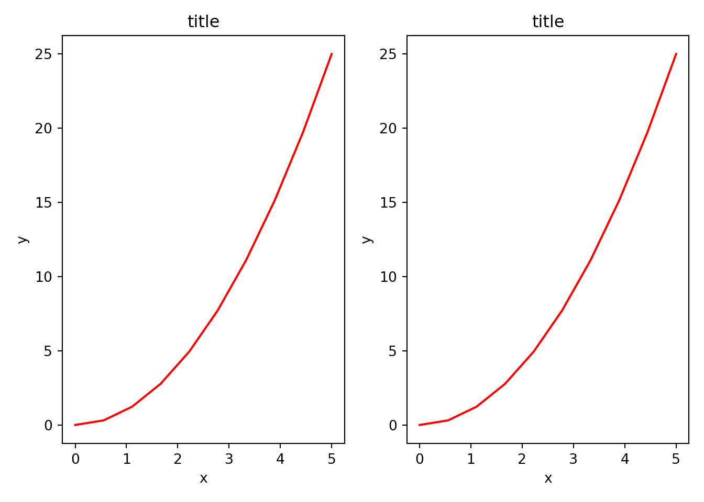

#### Avoid Overlap - Change Figure Size


```python
fig, axes = plt.subplots( nrows=1,ncols=2,figsize=(12,3))
for ax in axes:
    ax.plot(x, y, 'r')
    ax.set_xlabel('x')
    ax.set_ylabel('y')
    ax.set_title('title')
plt.show()
```

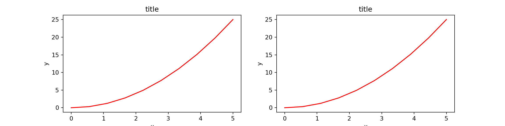

#### Text Within Figure


```python
fig = plt.figure()
fig.text(0.5, 0.5, 'This Is A Sample',fontsize=18, ha='center');
axes = fig.add_axes([0,0,1,1]) # left, bottom, width, height (range 0 to 1)
plt.show()
```


### Axes Customization

#### Y-Axis Limit


```python
fig = plt.figure()
fig.add_axes([0,0,1,1], ylim=(-2,5));
plt.show()
```


#### Text Within Axes


```python
fig, ax = plt.subplots(2, 3, sharex='col', sharey='row')
for i in range(2):
    for j in range(3):
        ax[i, j].text(0.5, 0.5, str((i, j)),
                      fontsize=18, ha='center')
plt.show()
```


```python
plt.text(0.5, 0.5, 'one',fontsize=18, ha='center')
plt.show()
```

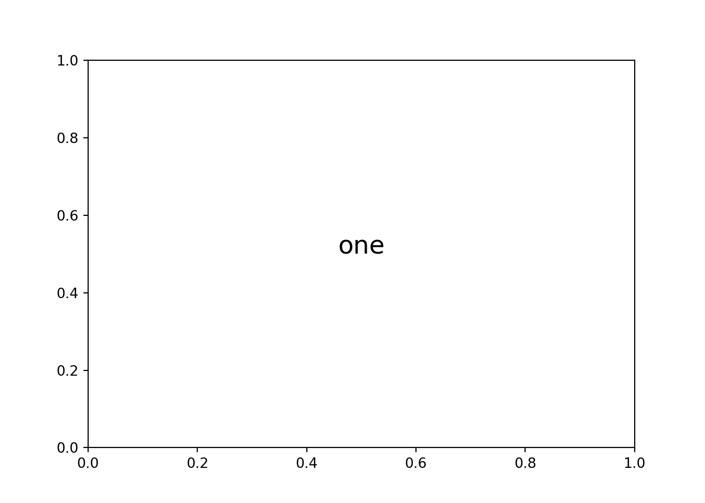

#### Share Y Axis Label


```python
fig, ax = plt.subplots(2, 3, sharex='col', sharey='row') # removed inner label
plt.show()
```

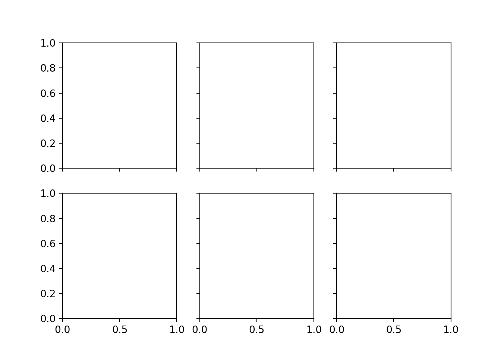

#### Create Subplot Individually
Each call lto **subplot()** will create a new container for subsequent plot command 


```python
plt.subplot(2,4,1)
plt.text(0.5, 0.5, 'one',fontsize=18, ha='center')

plt.subplot(2,4,8)
plt.text(0.5, 0.5, 'eight',fontsize=18, ha='center')
plt.show()
```

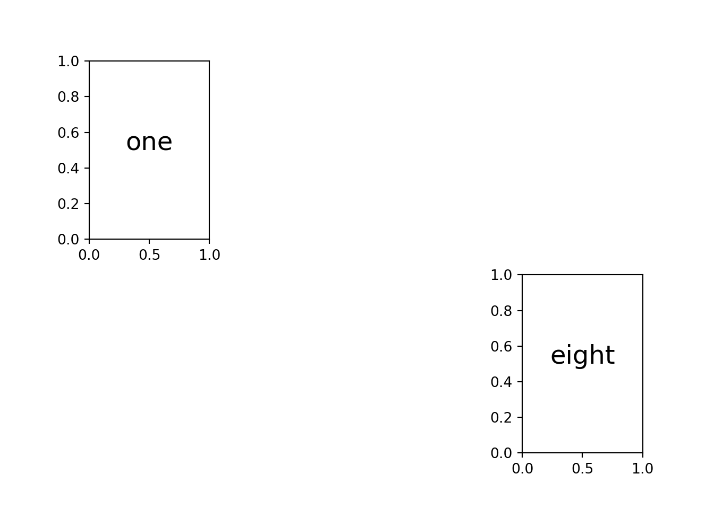

**Iterate through subplots (ax) to populate them**


```python
fig, ax = plt.subplots(2, 3, sharex='col', sharey='row')
for i in range(2):
    for j in range(3):
        ax[i, j].text(0.5, 0.5, str((i, j)),
                      fontsize=18, ha='center')
plt.show()
```

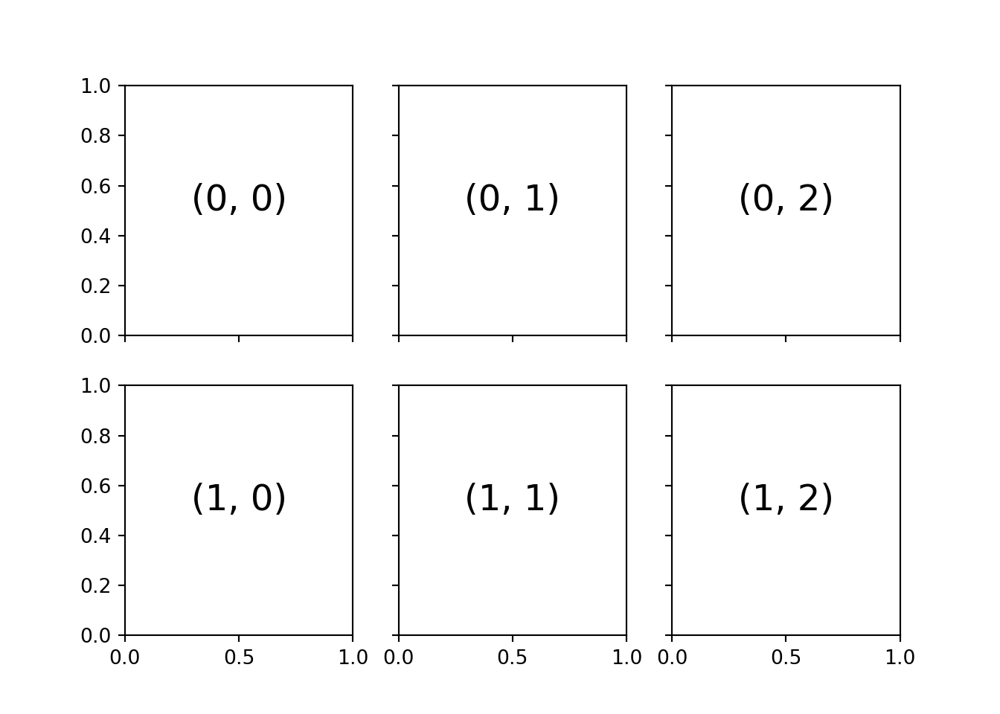

## Histogram


```python
plt.hist(mydf.value1, bins=12);
plt.show()
```

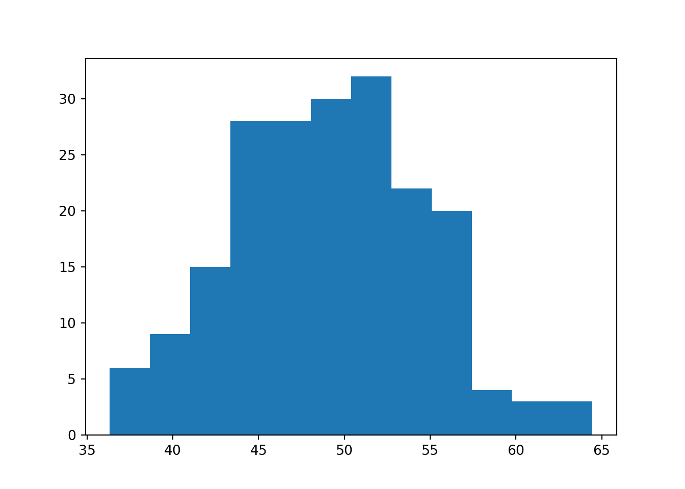

## Scatter Plot


```python
plt.scatter(mydf.value1, mydf.value2)
plt.show()
```

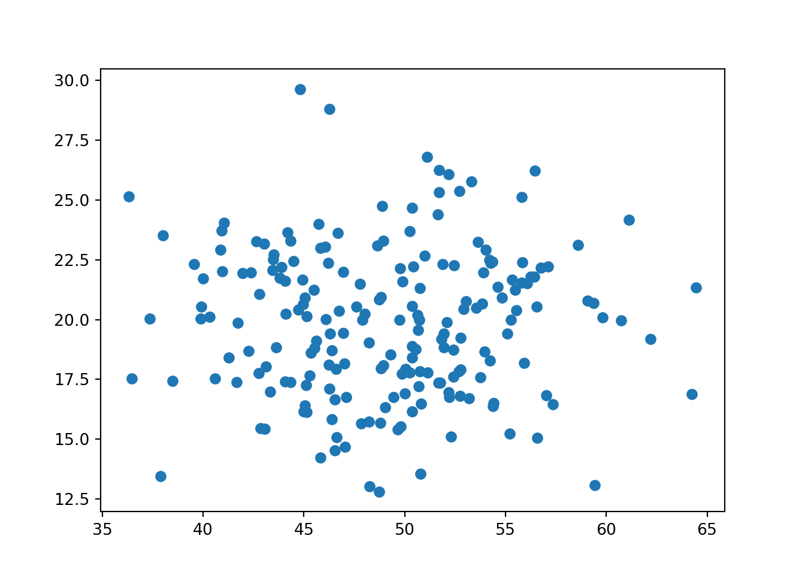


## Bar Chart


```python
com_grp = mydf.groupby('comp')
grpdf = com_grp['value1'].sum().reset_index()
grpdf
```

```
##   comp       value1
## 0   C1  2868.222230
## 1   C2  3491.425023
## 2   C3  3466.447272
```


```python
plt.bar(grpdf.comp, grpdf.value1);
plt.xlabel('Company')
plt.ylabel('Sum of Value 1')
plt.show()
```

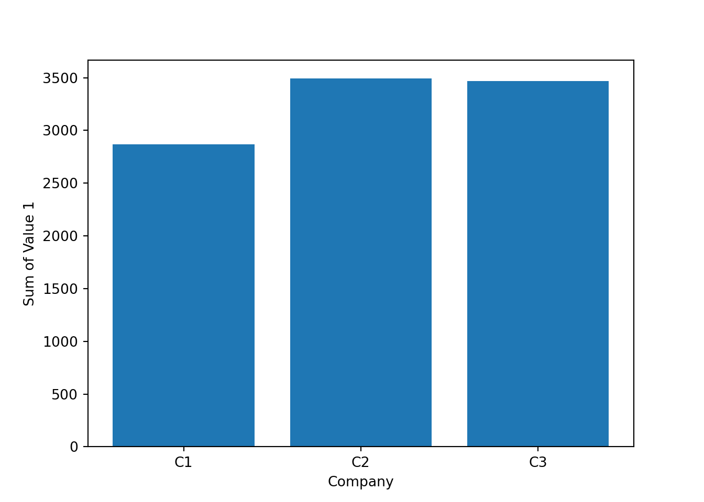

# seaborn

## Seaborn and Matplotlib
- seaborn **returns a matplotlib object** that can be modified by the options in the pyplot module  
- Often, these options are wrapped by seaborn and  .plot() in pandas and available as arguments

## Sample Data


```python
n = 100
comp = ['C' + i for i in np.random.randint( 1,4, size  = n).astype(str)] # 3x Company
dept = ['D' + i for i in np.random.randint( 1,4, size  = n).astype(str)] # 5x Department
grp =  ['G' + i for i in np.random.randint( 1,4, size  = n).astype(str)] # 2x Groups
value1 = np.random.normal( loc=50 , scale=5 , size = n)
value2 = np.random.normal( loc=20 , scale=3 , size = n)
value3 = np.random.normal( loc=5 , scale=30 , size = n)

mydf = pd.DataFrame({
    'comp':comp, 
    'dept':dept, 
    'grp': grp,
    'value1':value1, 
    'value2':value2,
    'value3':value3 
})
mydf.head()
```

```
##   comp dept grp     value1     value2     value3
## 0   C3   D1  G3  47.535295  20.117816  57.867254
## 1   C3   D2  G1  52.778405  25.702562  28.706413
## 2   C2   D1  G1  55.653373  27.851845  -0.735148
## 3   C1   D3  G1  49.293627  19.516519  41.628589
## 4   C3   D3  G1  58.408477  19.960534  27.661002
```

## Scatter Plot
### 2x Numeric


```python
sns.lmplot(x='value1', y='value2', data=mydf)
```


```python
plt.show()
```


```python
sns.lmplot(x='value1', y='value2', fit_reg=False, data=mydf);  #hide regresion line
```


```python
plt.show()
```


### 2xNumeric + 1x Categorical
Use **hue** to represent additional categorical feature


```python
sns.lmplot(x='value1', y='value2', data=mydf, hue='comp', fit_reg=False);
plt.show()
```


### 2xNumeric + 2x Categorical
Use **col** and **hue** to represent two categorical features


```python
sns.lmplot(x='value1', y='value2', col='comp',hue='grp', fit_reg=False, data=mydf);
plt.show()
```


### 2xNumeric + 3x Categorical
Use **row, col** and **hue** to represent three categorical features


```python
sns.lmplot(x='value1', y='value2', row='dept',col='comp', hue='grp', fit_reg=False, data=mydf);
```

```
## C:\PROGRA~3\Anaconda3\lib\site-packages\seaborn\axisgrid.py:447: RuntimeWarning: More than 20 figures have been opened. Figures created through the pyplot interface (`matplotlib.pyplot.figure`) are retained until explicitly closed and may consume too much memory. (To control this warning, see the rcParam `figure.max_open_warning`). Consider using `matplotlib.pyplot.close()`.
```

```python
plt.show()
```


### Customization

#### size
size: **height** in inch for each facet


```python
sns.lmplot(x='value1', y='value2', col='comp',hue='grp', fit_reg=False, data=mydf)
```


```python
plt.show()
```


Observe that even **size is very large**, lmplot will **fit (shrink) everything into one row** by deafult. See example below.


```python
sns.lmplot(x='value1', y='value2', col='comp',hue='grp',fit_reg=False, data=mydf)
```


```python
plt.show()
```


#### col_wrap

To avoid lmplot from shrinking the chart, we use **col_wrap=<col_number** to wrap the output.  
Compare the size (height of each facet) with the above **without** col_wrap. Below chart is larger.


```python
sns.lmplot(x='value1', y='value2', col='comp',hue='grp', col_wrap=2, fit_reg=False, data=mydf)
```


```python
plt.show()
```


## Histogram
```
seaborn.distplot(
  a,               # Series, 1D Array or List
  bins=None,
  hist=True,
  rug = False,
  vertical=False
)
```

### 1x Numeric


```python
sns.distplot(mydf.value1)
plt.show()
```


```python
sns.distplot(mydf.value1,hist=True,rug=True,vertical=True, bins=30,color='g')
plt.show()
```


## Bar Chart


```python
com_grp = mydf.groupby('comp')
grpdf = com_grp['value1'].sum().reset_index()
grpdf
```

```
##   comp       value1
## 0   C1  1872.786314
## 1   C2  1716.635804
## 2   C3  1427.112438
```

### 1x Categorical, 1x Numeric


```python
sns.barplot(x='comp',y='value1',data=grpdf)
plt.show()
```


### Customization

#### Ordering


```python
sns.barplot(x='comp',y='value2', hue='grp',
            order=['C3','C2','C1'],
            hue_order=['G1','G2','G3'],
            data=mydf
)
plt.show()
```


#### Flipping X/Y Axis


```python
sns.barplot(x='value2',y='comp', hue='grp',data=mydf)
plt.show()
```


## Faceting
Faceting in Seaborn is a generic function that works with matplotlib various plot utility.  
It support matplotlib as well as seaborn plotting utility. 

### Faceting Histogram


```python
g = sns.FacetGrid(mydf, col="comp", row='dept')
g.map(plt.hist, "value1")
```


```python
plt.show()
```


```python
g = sns.FacetGrid(mydf, col="comp", row='dept')
g.map(plt.hist, "value1")
```


```python
plt.show()
```


### Faceting Scatter Plot


```python
g = sns.FacetGrid(mydf, col="comp", row='dept',hue='grp')
g.map(plt.scatter, "value1","value2",alpha=0.7);
g.add_legend()
```


```python
plt.show()
```

```
## Traceback (most recent call last):
##   File "C:\PROGRA~3\Anaconda3\lib\site-packages\matplotlib\backends\backend_qt.py", line 454, in _draw_idle
##     self.draw()
##   File "C:\PROGRA~3\Anaconda3\lib\site-packages\matplotlib\backends\backend_agg.py", line 405, in draw
##     self.figure.draw(self.renderer)
##   File "C:\PROGRA~3\Anaconda3\lib\site-packages\matplotlib\artist.py", line 74, in draw_wrapper
##     result = draw(artist, renderer, *args, **kwargs)
##   File "C:\PROGRA~3\Anaconda3\lib\site-packages\matplotlib\artist.py", line 51, in draw_wrapper
##     return draw(artist, renderer)
##   File "C:\PROGRA~3\Anaconda3\lib\site-packages\matplotlib\figure.py", line 3071, in draw
##     mimage._draw_list_compositing_images(
##   File "C:\PROGRA~3\Anaconda3\lib\site-packages\matplotlib\image.py", line 131, in _draw_list_compositing_images
##     a.draw(renderer)
##   File "C:\PROGRA~3\Anaconda3\lib\site-packages\matplotlib\artist.py", line 51, in draw_wrapper
##     return draw(artist, renderer)
##   File "C:\PROGRA~3\Anaconda3\lib\site-packages\matplotlib\axes\_base.py", line 3071, in draw
##     self._update_title_position(renderer)
##   File "C:\PROGRA~3\Anaconda3\lib\site-packages\matplotlib\axes\_base.py", line 3004, in _update_title_position
##     if (ax.xaxis.get_ticks_position() in ['top', 'unknown']
##   File "C:\PROGRA~3\Anaconda3\lib\site-packages\matplotlib\axis.py", line 2399, in get_ticks_position
##     self._get_ticks_position()]
##   File "C:\PROGRA~3\Anaconda3\lib\site-packages\matplotlib\axis.py", line 2112, in _get_ticks_position
##     minor = self.minorTicks[0]
## IndexError: list index out of range
```


## Pair Grid


### Simple Pair Grid


```python
g = sns.PairGrid(mydf, hue='comp')
g.map(plt.scatter);
g.add_legend()
```


```python
plt.show()
```


### Different Diag and OffDiag


```python
g = sns.PairGrid(mydf, hue='comp')
g.map_diag(plt.hist, bins=15)
```


```python
g.map_offdiag(plt.scatter)
```


```python
g.add_legend()
```


```python
plt.show()
```


# plotnine


## Histogram


### 1xNumeric


```
plotnine.ggplot( dataframe, aex(x='colName')) + geom_histogram( bins=10 )
plotnine.ggplot( dataframe, aex(x='colName')) + geom_histogram( binwidth=? )
```


```python
plotnine.options.figure_size = (3, 3)
ggplot(mydf, aes(x='value1')) + geom_histogram()  # default bins = 10
```

```
## <ggplot: (123638816976)>
## 
## C:\PROGRA~3\Anaconda3\lib\site-packages\plotnine\stats\stat_bin.py:95: PlotnineWarning: 'stat_bin()' using 'bins = 8'. Pick better value with 'binwidth'.
```


```python
ggplot(mydf, aes(x='value1')) + geom_histogram(bins = 15)
```

```
## <ggplot: (123634616462)>
```


```python
ggplot(mydf, aes(x='value1')) + geom_histogram(binwidth = 3)
```

```
## <ggplot: (123638580297)>
```


### 1xNumeric + 1xCategorical


```
plotnine.ggplot( dataframe, 
                    aes(x='colName'), 
                    fill='categorical-alike-colName') 
+ geom_histogram()
```


```python
ggplot(mydf, aes(x='value1', fill='grp')) + geom_histogram(bins=15)
```

```
## <ggplot: (123638583056)>
```


## Scatter Plot


### 2x Numeric


```python
ggplot(mydf, aes(x='value1',y='value2')) + geom_point()
```

```
## <ggplot: (123639338355)>
```


### 2x Numeric + 1x Categorical
```
ggplot( DataFrame, aes(x='colName1',y='colName2')) 
    + geom_point( aes(
        color='categorical-alike-colName',
        size='numberColName'
    ))
```


```python
ggplot(mydf, aes(x='value1',y='value2')) + geom_point(aes(color='grp'))
```

```
## <ggplot: (123638788801)>
```


```python
ggplot(mydf, aes(x='value1',y='value2',color='grp')) + geom_point()
```

```
## <ggplot: (123634947837)>
```


```python
ggplot(mydf, aes(x='value1',y='value2')) + \
    geom_point(aes(
        color='grp'
    ))
```

```
## <ggplot: (123635254974)>
```


### 2x Numeric + 1x Numeric + 1x Categorical


```python
ggplot(mydf, aes(x='value1',y='value2')) + \
    geom_point(aes( 
        color='grp', size='value3'
    ))
```

```
## <ggplot: (123634920171)>
```


### Overlay Smooth Line


```python
ggplot(mydf, aes(x='value1', y='value2')) + \
    geom_point() + \
    geom_smooth()          # default method='loess'
```

```
## <ggplot: (123636654023)>
## 
## C:\PROGRA~3\Anaconda3\lib\site-packages\plotnine\stats\smoothers.py:321: PlotnineWarning: Confidence intervals are not yet implemented for lowess smoothings.
```


```python
ggplot(mydf, aes(x='value1', y='value2',fill='grp')) + \
    geom_point() + \
    geom_smooth(
        se=True,
        color='red',
        method='lm', 
        level=0.75)
```

```
## <ggplot: (123636420946)>
```


## Line Chart

### 2x Numeric Data


```python
ggplot (mydf.head(15), aes(x='value1', y='value2')) + geom_line()
```

```
## <ggplot: (123638807122)>
```


### 1x Numeric, 1x Categorical


```python
ggplot (mydf.head(15), aes(x='dept', y='value1')) + geom_line()
```

```
## <ggplot: (123638624732)>
```


```python
ggplot (mydf.head(30), aes(x='dept', y='value1')) + geom_line( aes(group=1))
```

```
## <ggplot: (123634653148)>
```


### 2x Numeric, 1x Categorical


```python
ggplot (mydf.head(15), aes(x='value1', y='value2')) + geom_line( aes(color='grp'),size=2)
```

```
## <ggplot: (123639514019)>
```


## Bar Chart

#### 1x Categorical
Single categorical variable produces frequency chart.


```python
tmpdf = mydf.groupby(['comp'],as_index=False).count()
tmpdf
```

```
##   comp  dept  grp  value1  value2  value3
## 0   C1    38   38      38      38      38
## 1   C2    34   34      34      34      34
## 2   C3    28   28      28      28      28
```


```python
tmpdf.info()
```

```
## <class 'pandas.core.frame.DataFrame'>
## RangeIndex: 3 entries, 0 to 2
## Data columns (total 6 columns):
##  #   Column  Non-Null Count  Dtype 
## ---  ------  --------------  ----- 
##  0   comp    3 non-null      object
##  1   dept    3 non-null      int64 
##  2   grp     3 non-null      int64 
##  3   value1  3 non-null      int64 
##  4   value2  3 non-null      int64 
##  5   value3  3 non-null      int64 
## dtypes: int64(5), object(1)
## memory usage: 272.0+ bytes
```


```python
ggplot (tmpdf, aes(x='comp', y='grp')) +geom_col()
```

```
## <ggplot: (123639444074)>
```


